# Presence Absence App (Bachelor Project)
This Android application was developed as my final project for my Bachelor's degree, under the supervision of **Professor Haleh Amintoosi**([Webpage](http://prof.um.ac.ir/amintoosi/)) and **Professor Abbas Rasoolzadegan**([WebPage](http://prof.um.ac.ir/rasoolzadegan)). The app is designed to manage student attendance during exams, offering a variety of modern features, technologies, and security practices to ensure a seamless user experience.

## Features
### Networking and API
- **OkHttp**: Handles network requests efficiently.
- **Retrofit**: Manages API interactions for data exchange.
- **Flow**: Supports reactive programming and efficient data handling.
- **Coroutines**: Enables asynchronous programming for smooth operation.
- **GSON**: Processes JSON data for serialization and deserialization.

### Dependency Injection and Plugins
- **Hilt**: Provides dependency injection to streamline object management.
- **KSP (Kotlin Symbol Processing)**: Compiler plugin that enables annotation processing for optimized code generation.
- **Gradle 8**: Utilizing the latest Gradle and dependency versions.

### User Interface and Design (UI/UX)
- **Material Design**: Ensures the app follows modern UI/UX principles for an intuitive interface.
- **View & Data Binding**: Efficiently binds UI components to data.
- **Binding Adapter**: Enhances the flexibility of UI component customization.
- **Glide**: Loads images efficiently from URLs into the app.
- **Bottom Sheets & Swipe Refresh**: For filters and refreshing content.
- **Snackbars & Dialogs**: To display messages.

### Security and Backend
- **Firebase**: Integrates with Google’s cloud backend services.
- **Two-step exit**: Ensuring proper handling of app exits.
- **Token expiration handling**: Secure session management.
- **RootBeer**: Ensures security with root detection to prevent unauthorized access.
- **Obfuscation**: Enhances code security by obfuscating the codebase to make reverse engineering difficult.

## Latest Technology Stack
- **DSL (Domain-Specific Language)**: Simplifies complex logic for handling custom use cases.
- **KSP (Kotlin Symbol Processing)**: Compiler plugin that enables annotation processing for optimized code generation.
- **Gradle 8**: The project is built using the latest Gradle version for improved build performance.
- **Latest Dependency Versions**: Keeps the app up-to-date with current Android standards.

## Architectural Overview
- **MVVM (Model-View-ViewModel)**: Organizes code in a way that separates the business logic from the UI to ensure a clean architecture.
- **Clean Architecture**: Divides code into layers (data, domain, and UI) for better maintainability.
- **Shared ViewModel**: Shares data among multiple fragments to avoid redundancy.
- **View State**: Stores fragment-related data, which is updated when API request results arrive.
- **UiState**: Manages the UI’s response to state changes based on the ViewModel.

## UI and User Experience
- **Flow Widget**: Enables an ample, interactive space for filtering data within the app.

<p align="center">
   
   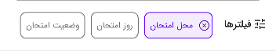
   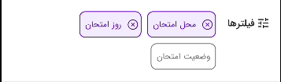
</p>

- **Dialogs & Snackbars**: Provides user feedback with interactive messages.

<p align="center">
   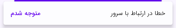
   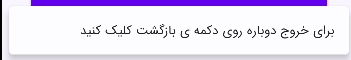
   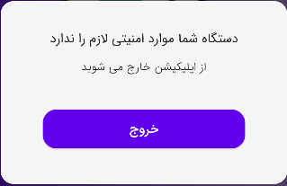
</p>

- **Bottom Sheets**: Allows for applying filters with ease.
  
<p align="center">
   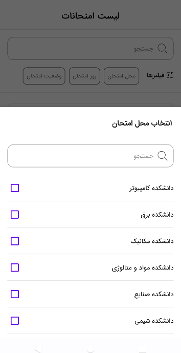
   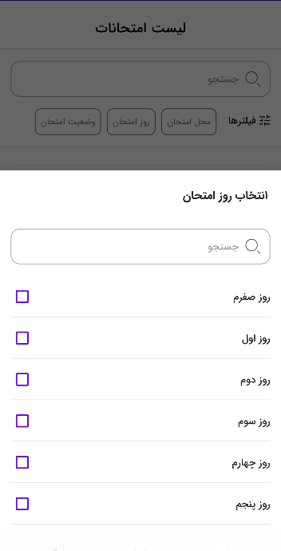
</p>

- **Swipe Refresh**: Refreshes displayed data with a simple swipe gesture, ensuring an up-to-date user experience.
  
<p align="center">
   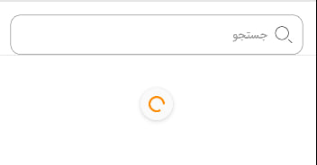
</p>

- **Input validation**: Ensures users provide valid inputs before submission to avoid errors.
  
<p align="center">
   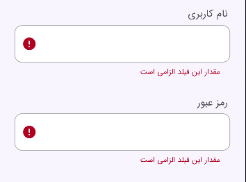
   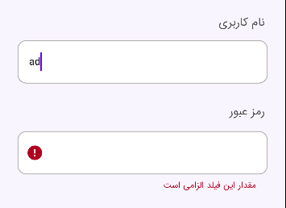
   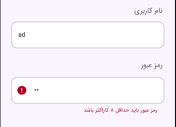
</p>

## Screenshots and output
<p align="center">
   
   
   
</p>

<p align="center">
   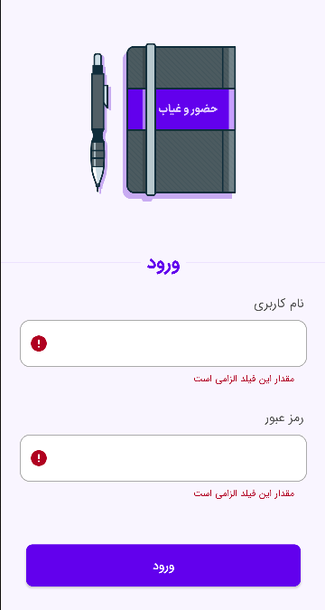
   
   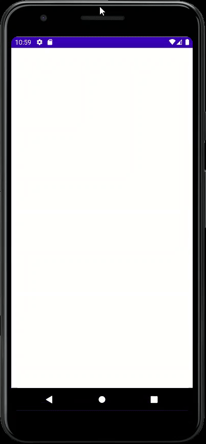
</p>

## Installation
1. Clone the repository:
```bash
git clone https://github.com/your-repo-url.git
```
2. Open in Android Studio.
3. Sync Gradle and install the necessary dependencies.


## License
This project is licensed under the MIT License - see the [LICENSE](LICENSE) file for details.
